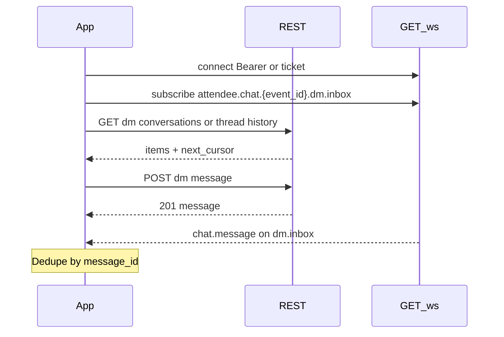

# Event Chat — Client Implementation Guide

This guide explains how mobile and web clients should integrate **event-scoped chat**: a **general room** for all registered attendees and **1:1 direct messages (DM)** between attendees in the same event.

Chat is **not** available outside an event. There is no global or cross-event messaging.

**Related docs**

- REST details: Swagger (`/swagger/`) — search tag `attendee`, paths under `/attendee/events/{eventID}/chat/...`
- WebSocket multiplexing (shared with agenda realtime): [agenda-realtime-websocket-architecture.md](./agenda-realtime-websocket-architecture.md)
- WebSocket message schemas: `GET /ws/asyncapi.json`

---

## Overview

| Concern | Transport | Notes |
|--------|-----------|-------|
| Send message | REST `POST` | Source of truth; always persists before push |
| Load history | REST `GET` | Cursor-based pagination |
| Live delivery | WebSocket `GET /ws` | `chat.message` on subscribed topics |
| Offline / reconnect | REST history | WS is best-effort notification |

Use **one shared WebSocket connection** per app session and multiplex chat with agenda and other topics (see agenda doc).



---

## Prerequisites

1. User is authenticated (`Authorization: Bearer <JWT>` on REST).
2. User is **registered** for the event (`POST /attendee/events/{eventID}/registrations` or equivalent).
3. For DM: the **recipient** must also be registered for the same event.

Unregistered users receive `403` with `error.code: not_registered_for_event` on chat REST endpoints, and `forbidden` on WebSocket subscribe.

---

## REST API

All responses use the standard envelope:

```json
{ "data": <payload>, "error": null }
```

Errors:

```json
{ "data": null, "error": { "code": "...", "message": "...", "show_to_user": true } }
```

### Send message body

Used by both general and DM send endpoints:

```json
{
  "body": "Hello everyone!",
  "client_msg_id": "optional-client-uuid"
}
```

| Field | Required | Rules |
|-------|----------|-------|
| `body` | yes | Trimmed non-empty string, max **2000** characters |
| `client_msg_id` | no | Max **64** characters; enables idempotent retries |

### Message object (`data` on send / items in lists)

```json
{
  "message_id": "550e8400-e29b-41d4-a716-446655440099",
  "event_id": "550e8400-e29b-41d4-a716-446655440000",
  "channel_type": "general",
  "conversation_id": null,
  "sender_user_id": "550e8400-e29b-41d4-a716-446655440001",
  "sender_name": "Ada",
  "sender_last_name": "Lovelace",
  "sender_profile_picture_url": "https://cdn.example/avatar.png",
  "recipient_user_id": null,
  "body": "Hello everyone!",
  "created_at": "2026-06-08T12:00:00Z"
}
```

For DM messages:

- `channel_type` is `"dm"`
- `conversation_id` is set (see [DM conversation ID](#dm-conversation-id))
- `recipient_user_id` is the other participant’s user UUID

Email is **never** included in chat payloads.

---

### General chat

#### Send

```
POST /attendee/events/{eventID}/chat/general/messages
Authorization: Bearer <token>
Content-Type: application/json
```

| Status | Meaning |
|--------|---------|
| `201` | New message created |
| `200` | Idempotent repeat (same `client_msg_id` from same sender) |
| `400` | Invalid body / validation |
| `403` | Not registered for event |
| `401` | Missing or invalid token |

#### History

```
GET /attendee/events/{eventID}/chat/general/messages?limit=50&cursor=<opaque>
```

Query parameters:

| Param | Default | Max | Description |
|-------|---------|-----|-------------|
| `limit` | `50` | `100` | Messages per page |
| `cursor` | (none) | — | Opaque token from previous `next_cursor` |

Response `data`:

```json
{
  "items": [ /* message objects, oldest first within page */ ],
  "next_cursor": "eyJjcmVhdGVkX2F0IjoiLi4uIiwiaWQiOiIuLi4ifQ"
}
```

Omit `next_cursor` when empty — no more pages.

**Pagination direction:** Each page returns messages in **chronological order** (oldest → newest within the page). To load **older** messages, pass `cursor` from the previous response’s `next_cursor`. First request: no cursor (loads the most recent page).

---

### Direct messages (DM)

#### DM conversation ID

Each 1:1 thread in an event has a deterministic ID derived from the event and the two user UUIDs (sorted lexicographically, lowercase):

```
dm:{event_id}:{min_user_uuid}:{max_user_uuid}
```

Example:

```
dm:550e8400-e29b-41d4-a716-446655440000:11111111-1111-1111-1111-111111111111:22222222-2222-2222-2222-222222222222
```

Clients can compute this locally to filter WebSocket `chat.message` frames by thread. It is **not** a WebSocket subscribe topic.

#### Send DM

```
POST /attendee/events/{eventID}/chat/dm/{recipientUserID}/messages
```

Same request body and status codes as general send. `recipientUserID` must be a registered attendee in the event and must not equal the caller.

`404` is returned when the recipient is not registered for the event (treated as not found for privacy).

#### DM history

```
GET /attendee/events/{eventID}/chat/dm/{recipientUserID}/messages?limit=50&cursor=<opaque>
```

Same list shape as general history (`items` + `next_cursor`). Cursor `id` field encodes the **message** `message_id`.

#### DM inbox (conversation list)

```
GET /attendee/events/{eventID}/chat/dm/conversations?limit=50&cursor=<opaque>
```

Response `data`:

```json
{
  "items": [
    {
      "conversation_id": "dm:550e8400-...:user-a:user-b",
      "other_user_id": "22222222-2222-2222-2222-222222222222",
      "last_message": { /* full message object */ }
    }
  ],
  "next_cursor": "..."
}
```

Items are ordered by **most recent activity first**. For inbox pagination, cursor `id` is the **`conversation_id`** (not `message_id`). Treat `next_cursor` as opaque — do not construct it client-side for inbox pages.

---

## WebSocket (live updates)

Chat uses the **same** multiplexed socket as agenda realtime.

### Connect

```
GET /ws
```

Authentication (pick one):

| Method | Use when |
|--------|----------|
| `Authorization: Bearer <JWT>` | Native apps, clients that can set WS headers |
| `GET /ws?ticket=<short-lived-jwt>` | Browsers; obtain ticket via `POST /attendee/events/{eventID}/agenda/ws/ticket` |

When using `?ticket=`, subscriptions are limited to topics for **that ticket’s event** only.

### Multiplex envelope

All frames are JSON:

```json
{
  "type": "<message_kind>",
  "topic": "<logical_channel>",
  "data": { },
  "id": "<optional_client_trace_id>",
  "ts": "2026-06-08T12:00:00Z"
}
```

### Subscribe to chat topics

After the socket is open, send:

**General room** (subscribe when viewing general chat)

```json
{
  "type": "subscribe",
  "topic": "attendee.chat.{event_id}.general"
}
```

**DM inbox** (subscribe once per event on enter; covers all DM threads for the authenticated user)

```json
{
  "type": "subscribe",
  "topic": "attendee.chat.{event_id}.dm.inbox"
}
```

Replace `{event_id}` with lowercase UUID. The server binds this subscription to the authenticated user — do not include `user_id` in the topic string.

**Unsubscribe** when leaving a screen (general chat only; keep DM inbox subscribed while in the event):

```json
{
  "type": "unsubscribe",
  "topic": "attendee.chat.{event_id}.general"
}
```

**Ping** (optional keepalive):

```json
{ "type": "ping", "id": "trace-1" }
```

Server replies:

```json
{ "type": "pong", "id": "trace-1", "ts": "..." }
```

### Server push: `chat.message`

When any attendee sends a message (including the current user), subscribers on the matching topic receive:

**General chat example:**

```json
{
  "type": "chat.message",
  "topic": "attendee.chat.550e8400-e29b-41d4-a716-446655440000.general",
  "data": {
    "message_id": "...",
    "event_id": "...",
    "channel_type": "general",
    "conversation_id": null,
    "sender_user_id": "...",
    "sender_name": "...",
    "sender_last_name": "...",
    "sender_profile_picture_url": "...",
    "recipient_user_id": null,
    "body": "...",
    "created_at": "..."
  },
  "ts": "2026-06-08T12:00:00Z"
}
```

**DM inbox example:**

```json
{
  "type": "chat.message",
  "topic": "attendee.chat.550e8400-e29b-41d4-a716-446655440000.dm.inbox",
  "data": {
    "message_id": "...",
    "event_id": "...",
    "channel_type": "dm",
    "conversation_id": "dm:550e8400-...:user-a:user-b",
    "sender_user_id": "...",
    "sender_name": "...",
    "sender_last_name": "...",
    "sender_profile_picture_url": "...",
    "recipient_user_id": "...",
    "body": "...",
    "created_at": "..."
  },
  "ts": "2026-06-08T12:00:00Z"
}
```

`data` matches the REST message object shape. DM pushes are delivered to **both** sender and recipient inbox subscriptions (multi-device sync).

### Subscribe errors

```json
{
  "type": "error",
  "topic": "attendee.chat....",
  "data": { "code": "forbidden", "message": "forbidden" }
}
```

Common codes: `forbidden`, `invalid_topic`, `invalid_message`.

---

## Recommended client flows

### Event enter (chat-enabled)

1. Ensure WS connected (app-level singleton).
2. `subscribe` → `attendee.chat.{event_id}.dm.inbox`
3. Keep inbox subscription for the duration of the event session.

### General chat screen

1. `subscribe` → `attendee.chat.{event_id}.general`
2. `GET .../chat/general/messages` (no cursor) → render latest page.
3. On `chat.message` for general topic → append if `message_id` not already in list.
4. On send → `POST .../chat/general/messages` with optional `client_msg_id`.
   - On `201`/`200`, you may append from response **or** wait for WS push — **dedupe by `message_id`**.
5. On scroll up → `GET` with `next_cursor` to load older messages.
6. On leave screen → `unsubscribe` general topic (keep DM inbox subscription).

### DM thread screen

1. Compute `conversation_id` from `event_id`, self `user_id`, and `recipient_user_id` (for filtering only).
2. `GET .../chat/dm/{recipientUserID}/messages` for initial history.
3. Send via `POST .../chat/dm/{recipientUserID}/messages`.
4. On `chat.message` where `topic` is DM inbox and `data.conversation_id` matches the open thread → append (dedupe by `message_id`).
5. No extra WebSocket subscribe/unsubscribe when opening or leaving the thread.

### DM inbox screen

1. `GET .../chat/dm/conversations` (paginate with `next_cursor`).
2. Display `other_user_id`, `last_message` preview, sort as returned (recent first).
3. On `chat.message` where `channel_type` is `"dm"` → update conversation row / unread badge.
4. Tap row → open DM thread flow above.

### App startup / reconnect

1. Reconnect `/ws` and re-subscribe active topics (including DM inbox per event).
2. Refetch history for open screens (WS may have missed messages while offline).
3. Merge REST history with local state; WS is not a durable log.

---

## Idempotency and deduplication

**Sending:** Include a stable `client_msg_id` (e.g. UUID per outbound message). If the network fails after the server accepted the request, retry with the same `client_msg_id` — server returns `200` with the original message instead of creating a duplicate.

**Receiving:** Maintain a set or map of seen `message_id` values. Ignore WS pushes or REST duplicates already in UI state. The same DM message may arrive via REST response and WS push — dedupe globally by `message_id`.

---

## Error handling cheat sheet

| HTTP | `error.code` (typical) | Client action |
|------|------------------------|---------------|
| `401` | `unauthorized` | Re-authenticate |
| `403` | `not_registered_for_event` | Prompt registration or hide chat |
| `404` | `not_found` | Event missing or DM recipient not in event |
| `400` | `invalid_request_body` | Fix validation (body length, cursor, etc.) |

---

## Limits and non-goals (v1)

| Feature | v1 behavior |
|---------|-------------|
| Attachments | Not supported — text only |
| Typing indicators | Not supported |
| Read receipts | Not supported |
| Message edit/delete | Not supported |
| Push notifications (APNs/FCM) | Not supported — in-app WS + REST only |
| Organizers without registration | Must be registered like any attendee |
| Per-conversation WebSocket topic | Not supported — use DM inbox + `conversation_id` filter |

---

## Example: minimal send + subscribe (pseudo-code)

```text
// 1. Open shared WebSocket (once per app)
ws.connect("wss://api.example/ws", headers: { Authorization: "Bearer ..." })

// 2. Enter event — subscribe DM inbox once
ws.send({ type: "subscribe", topic: "attendee.chat." + eventId + ".dm.inbox" })

// 3. Open general chat screen
ws.send({ type: "subscribe", topic: "attendee.chat." + eventId + ".general" })
history = GET("/attendee/events/" + eventId + "/chat/general/messages?limit=50")

// 4. Send general message
clientMsgId = uuid()
res = POST("/attendee/events/" + eventId + "/chat/general/messages", {
  body: "Hi!",
  client_msg_id: clientMsgId
})

// 5. On WS frame
onMessage(frame):
  if frame.type != "chat.message" || seen.has(frame.data.message_id):
    return
  seen.add(frame.data.message_id)
  if frame.data.channel_type == "dm":
    updateInbox(frame.data)
    if openThreadId == frame.data.conversation_id:
      appendToThreadUI(frame.data)
  else if frame.topic.endsWith(".general"):
    appendToGeneralUI(frame.data)
```

---

## Topic reference

| Channel | WebSocket subscribe topic | Server push `topic` |
|---------|---------------------------|---------------------|
| General | `attendee.chat.{event_id}.general` | same |
| DM inbox | `attendee.chat.{event_id}.dm.inbox` | `attendee.chat.{event_id}.dm.inbox` |

`{event_id}`: lowercase UUID of the event.

`conversation_id` (`dm:{event_id}:{user_a}:{user_b}`) is used in REST and in `chat.message` `data` for thread filtering — **not** as a WebSocket topic.
