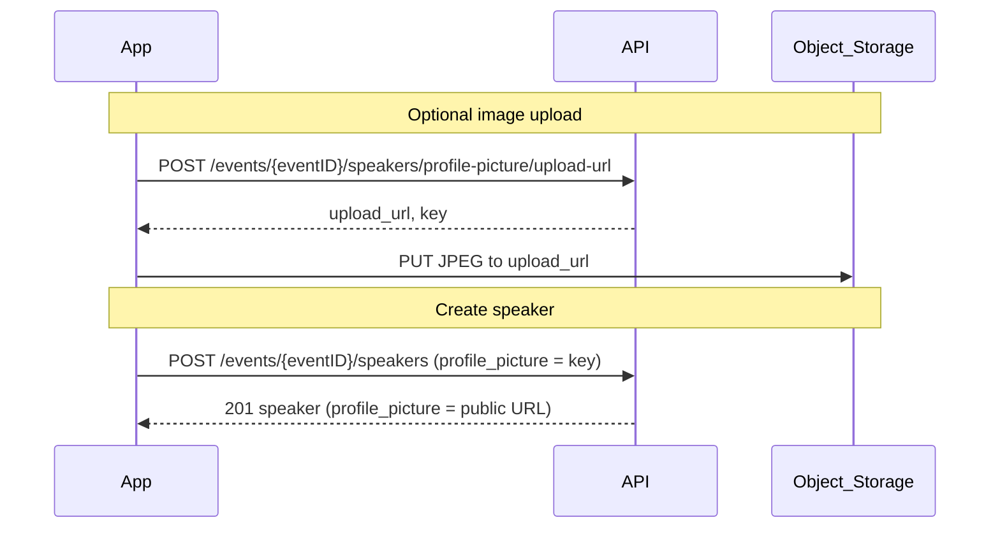

# Speaker Creation — Client Implementation Guide

This guide explains how clients create a **manual speaker** for an event and optionally attach a **profile picture** uploaded to object storage.

The backend never receives image bytes. Clients upload JPEG files directly to S3/MinIO using a presigned URL, then pass the returned object key when creating or updating the speaker.

**Related docs**

- REST details: Swagger (`/swagger/`) — tag `events`
- Same presign pattern: user avatar (`POST /users/me/avatar/upload-url`) and event thumbnail (`POST /events/{eventID}/thumbnail/upload-url`)

---

## Overview

| Concern | Notes |
|--------|-------|
| Who can create | Event **owner** only |
| Profile picture | Optional; JPEG via presigned PUT |
| Write `profile_picture` | S3 **object key** from upload-url |
| Read `profile_picture` | Public **URL** (Sessionize-imported speakers may return external `https://` URLs) |



---

## Prerequisites

1. User is authenticated (`Authorization: Bearer <JWT>`).
2. User is the **owner** of the event (`eventID`).
3. At least one of `first_name` or `last_name` is non-empty on create.

---

## Step-by-step

### Step 1 (optional) — Get upload URL

```http
POST /events/{eventID}/speakers/profile-picture/upload-url
Authorization: Bearer <token>
```

**Success (200)**

```json
{
  "data": {
    "upload_url": "https://storage.example/bucket/speaker-avatars/ev-1/abc.jpg?...",
    "key": "speaker-avatars/ev-1/abc.jpg"
  },
  "error": null
}
```

Save `key` for step 3. The presigned URL expires in **15 minutes**.

### Step 2 (optional) — Upload image to storage

Send the image **directly to `upload_url`**, not to the API.

```http
PUT {upload_url}
Content-Type: image/jpeg

<JPEG bytes>
```

Use `image/jpeg` as the content type. Other formats are not supported by this endpoint.

### Step 3 — Create speaker

```http
POST /events/{eventID}/speakers
Authorization: Bearer <token>
Content-Type: application/json
```

**Request body**

```json
{
  "first_name": "Jane",
  "last_name": "Doe",
  "phone_number": "+1 555 000 1111",
  "bio": "Conference speaker and engineer.",
  "tag_line": "Building better APIs",
  "profile_picture": "speaker-avatars/ev-1/abc.jpg",
  "is_top_speaker": false
}
```

Omit `profile_picture` or send `""` if no image was uploaded.

**Success (201)**

```json
{
  "data": {
    "id": "550e8400-e29b-41d4-a716-446655440000",
    "event_id": "ev-1",
    "first_name": "Jane",
    "last_name": "Doe",
    "profile_picture": "https://cdn.example/speaker-avatars/ev-1/abc.jpg",
    "source": "admin_app",
    "is_top_speaker": false
  },
  "error": null
}
```

On read, `profile_picture` is a public URL. On write, pass the **key** from step 1.

---

## Updating a speaker image

1. Call `POST /events/{eventID}/speakers/profile-picture/upload-url` again (new key each time).
2. `PUT` the new JPEG to the new `upload_url`.
3. `PATCH /events/{eventID}/speakers/{speakerID}` with:

```json
{
  "profile_picture": "speaker-avatars/ev-1/new-key.jpg"
}
```

Only include fields you want to change.

---

## `profile_picture` semantics

| Direction | Value |
|-----------|--------|
| **Request** (create / patch) | S3 object key, e.g. `speaker-avatars/{eventID}/{random}.jpg` |
| **Response** (list / get / create / patch) | Public CDN URL when the speaker was created via this app |
| **Sessionize imports** | May remain an external `https://` URL unchanged |

Keys must start with `speaker-avatars/{eventID}/` for the given event. Other keys return `400` with `error.code: invalid_request_body`.

---

## Common errors

| HTTP | `error.code` | When |
|------|----------------|------|
| 400 | `missing_path_param` | `eventID` missing from path |
| 400 | `invalid_request_body` | Validation failed, or `profile_picture` key has wrong prefix |
| 401 | `unauthorized` | Missing or invalid Bearer token |
| 403 | `not_event_owner` | Caller is not the event owner |
| 404 | `event_not_found` | Event does not exist |
| 500 | `internal_error` | Server or storage misconfiguration |

All responses use the standard envelope: `{ "data": ..., "error": ... }`.

---

## Minimal flow without image

If no profile picture is needed, skip steps 1–2 and POST the speaker with an empty `profile_picture`:

```json
{
  "first_name": "Jane",
  "last_name": "Doe"
}
```
